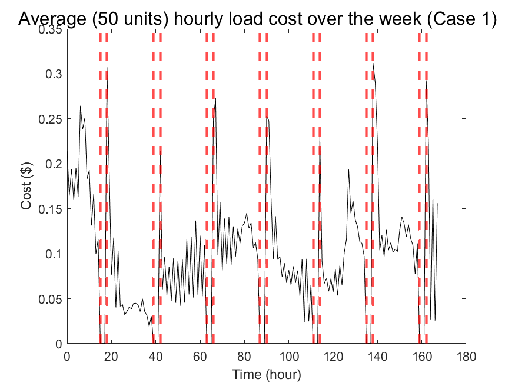
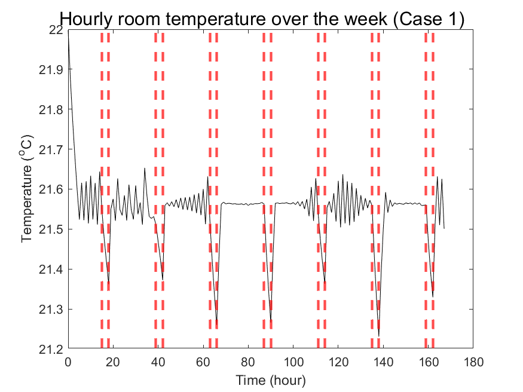
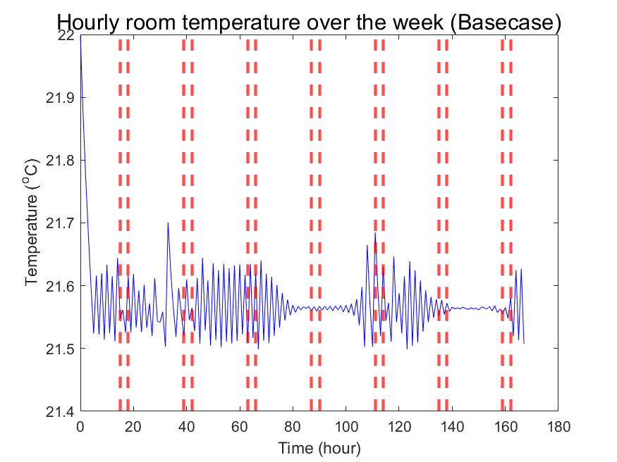

# Demand Response Simulation with Day-Ahead Prices and Heating Load Dynamics

**HVAC Demand Response with Day-Ahead Prices (MATLAB)**

Simulate residential space-heating dynamics at minute resolution over a week using day-ahead (DA) zonal prices and ambient temperature. The project compares:

  - Basecase (normal thermostat operation)
  - DR Case 1 (forced OFF during 15:00–18:00)
  - DR Case 2 (thermostat setpoint lowered to 18 °C during 15:00–18:00)

It reports per-minute load/temperature trajectories, neighborhood aggregation for 50 units, and hourly cost computed from DA prices. All figures are saved to /results.

 - The input CSVs must be placed in inputdata/
   - DA price tables are expected to reshape as [hours × 15 zones].
   - Temperature table must contain a datetime column compatible with the DA timestamps.
  
**What the Code Does (High-Level)**

  - Loads DA prices and temperature for a 7-day window (168 hours).
  - Builds a per-minute series for the selected zone (e.g., N.Y.C.).
  - Simulates a 2-state (air/mass) thermal model with ON/OFF hysteresis:
      - Basecase: normal thermostat with deadband.
      - DR Case 1: force compressor OFF from 15:00–18:00.
      - DR Case 2: lower setpoint to 18 °C from 15:00–18:00.
  - Aggregates 50 heterogeneous homes (randomized parameters).
  - Converts minute → hourly (group of 60) to compute hourly cost:
      - Cost_t = \frac{1}{60} \sum_{min in hr} Q\times \frac{DA Price_t}{1e6}
   
**Key Plots (Examples)**
Below are example embeds that should work after your first run (filenames may shift depending on how many figures you generate; you can update the numbers to match your run):
Hourly Room Temperature — Basecase (Week)

Hourly Room Temperature — DR Case 1 (Week)

Hourly Room Temperature — DR Case 2 (Week)

**Configuration Notes**
  - DR Window: 15:00–18:00 (hard-coded in Main.m; search for xline(15 / xline(18 to change).
  - Zone column: zone_col = 10 (N.Y.C.). Change to analyze a different zone.
  - Per-minute resolution: The simulation stores exactly 60 points/hour to avoid size mismatches.
  - Neighborhood size: 50 homes with randomized parameters (means and variances match comments).

**Author:**
  - Developed by Behnam Jabbari Marand, Ph.D. Student, NC State University
  - Focus: Optimization, integer programming, and power systems applications.
